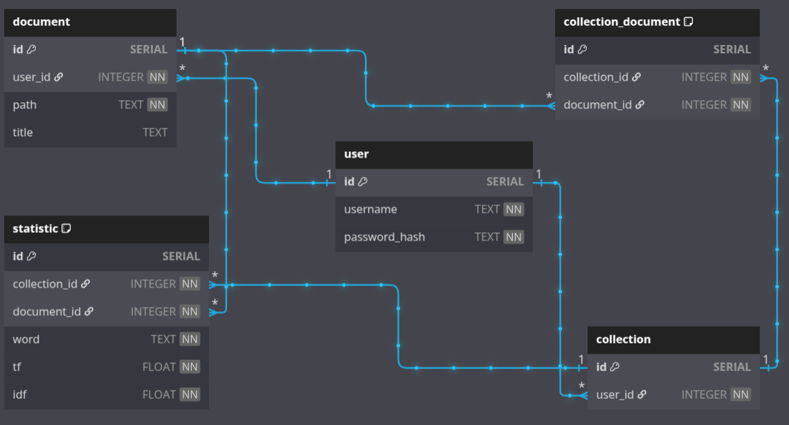

# Веб-приложение для анализа tf и idf
## Описание
Веб-приложение, которое позволяет пользователю провести анализ текстовых 
документов на частоту слов в отдельно взятом документе (TF) 
и обратную частоту слов в коллекции документов (IDF).

Сущности приложения: 
* Документ — текстовый файл, хранящийся на диске, имеющий уникальный идентификатор
* Коллекция — набор документов, для которых статистика частично (IDF)
считается единой
* Статистика — набор из 50 наиболее редко встречающихся в документе слов их
частота (TF) и обратная частота документа (IDF в рамках коллекции) для них
* Пользователь — уникальный пользователь системы, может загружать документы в
коллекции, управлять ими: добавлять уже загруженный документ в коллекцию,
удалять документ из коллекции с пересчётом статистики. Имеет уникальный id,
авторизуется по логину и паролю
## Использование
### Версия приложения - 1.3.0
### Описание API
* По адресу http://37.9.53.208:8080/docs доступен Swagger документацией проекта
## Подготовка к запуску
1. Для запуска потребуется docker-compose. Убедитесь в его наличии. 
Ознакомиться с установкой можно по ссылке https://docs.docker.com/compose/install/
2. Необходимо скачать из репозитория:
   * docker-compose.yaml, команда:  *curl -o docker-compose.yaml https://raw.githubusercontent.com/Vinogradnij/lestaweb_tfidf/refs/heads/master/docker-compose.yaml*
   * .env-template, команда:  *curl -o .env-template https://raw.githubusercontent.com/Vinogradnij/lestaweb_tfidf/refs/heads/master/.env-template*
3. В файле .env-template определить свои настройки для:
   * Базы данных - задать порт, имя и пароль пользователя, имя базы данных
   * Сервера - задать свой адрес хоста и порт
   * Безопасности - задать алгоритм (Например, HS256) и секретный ключ.
Секретный ключ можно сгенерировать командой Linux: *openssl rand -base64 128*
4. Убедитесь, что docker-compose.yaml и .env-template находятся в одной директории
## Запуск
* Выполнить команду *docker compose up -d*
* Сервис будет доступен по адресу, указанному в .env-template файле
## Реализация
### Используемые инструменты
* В качестве веб-фреймворка выбран FastAPI.
* В качестве базы данных используется PostgreSQL.
* Для работы с базой данных используется SQLAlchemy 2.0.
* Для управления миграциями используется Alembic.
* Для лемматизации слов используется pymorphy3.
* Для проверки на стоп-слово используется nltk.
### Описание структуры проекта
```
lestaweb_tfidf
├── src
│   ├── alembic
│   │   ├── versions
│   │   ├── env.py
│   │   └── script.py.mako
│   ├── info
│   │   ├── crud.py
│   │   ├── router.py
│   │   └── schemas.py
│   ├── tfidf
│   │   ├── crud.py
│   │   ├── handler.py
│   │   ├── mixins.py
│   │   ├── models.py
│   │   ├── router.py
│   │   └── schemas.py
│   ├── users
│   │   ├── crud.py
│   │   ├── models.py
│   │   ├── router.py
│   │   ├── schemas.py
│   │   └── utils.py
│   ├── alembic.ini
│   ├── config.py
│   ├── database.py
│   ├── definitions.py
│   ├── dependencies.py
│   ├── main.py
│   └── prestart.sh
├── .dockerignore
├── .env-template
├── .gitignore
├── CHANGELOG.md
├── docker-compose.yaml
├── Dockerfile
├── README.md
└── requirements.txt
```
* alembic/ - директория библиотеки alembic
  * version/ - директория хранения файлов миграции
  * env.py - настройка миграций
  * script.py.mako - шаблон для alembic
* info/ - директория предназначенная для работы со служебной информацией приложения
  * crud.py - бизнес логика обработки путей
  * router.py - обработка путей информационных запросов
  * schemas.py - Pydantic схемы для info
* tfidf/ - директория предназначенная для работы с сущностями Документ, Коллекция, Статистика
  * crud.py - бизнес логика обработки путей
  * handler.py - обработка пользовательских файлов
  * mixins.py - файл с миксинами для моделей tfidf
  * models.py - модели данных для tfidf
  * router.py - обработка путей запросов анализа документов
  * schemas.py - Pydantic схемы для tfidf
* users/ - директория предназначенная для работы с сущностью Пользователь
  * crud.py - бизнес логика обработки путей
  * models.py - модели данных для user
  * router.py - обработка путей запросов связанными с пользователем
  * schemas.py - Pydantic схемы для users
* alembic.ini - настройка alembic
* config.py - конфигурационные настройки приложения
* database.py - управление соединением с БД
* definitions.py - файл хранящий различные path для работы с приложением
* dependencies.py - содержит зависимости для различных routers
* main.py - точка входа в приложение
* prestart.sh - скрипт запуска миграций базы данных
* .dockerignore - файл для указания docker о том, что не следует индексировать
* .env-template - пример .env файла для конфигурации
  * TFIDF__DB__HOST - адрес хоста базы данных. При использовании с docker-compose указывать имя сервиса базы данных
  * TFIDF__DB__PORT - порт для подключения к базе данных
  * TFIDF__DB__USER - имя пользователя базы данных
  * TFIDF__DB__PASSWOR - пароль пользователя базы данных
  * TFIDF__DB__NAME - имя базы данных
  * TFIDF__RUN__HOST - адрес для связи с приложением
  * TFIDF__RUN__PORT - порт для подключения к серверу
  * TFIDF__SECURITY__SECRET_KEY - ключ для шифрования и дешифрования данных
  * TFIDF__SECURITY__ALGORITHM - алгоритм для шифрования и дешифрования данных
* .gitignore - файл для указания git о том, что не следует индексировать
* CHANGELOG.md - описание изменений приложения согласно версионированию
* docker-compose.yaml - файл для сборки и запуска всех контейнеров приложения
* Dockerfile - файл, на основе которого строится образ сервиса backend файла docker-compose.yaml
* README.md - описание приложения, включая инструкции по настройке и запуску
* requirements.txt - зависимости приложения

### Описание структуры базы данных
Схема базы данных


* Таблица user
  * Представляет сущность Пользователь
  * id - первичный ключ
  * username - логин пользователя
  * password_hash - пароль пользователя. Хранится в зашифрованном виде

* Таблица document
  * Представляет сущность Документ
  * id - первичный ключ
  * user_id - внешний ключ к таблице user. Связь many-to-one
  * path - путь к файлу
  * title - название файла

* Таблица collection
  * Представляет сущность Коллекция
  * id - первичный ключ
  * user_id - внешний ключ к таблице user. Связь many-to-one

* Таблица collection_document
  * Отображение связи между таблицами document, collection
  * id - первичный ключ
  * collection_id - внешний ключ к таблице collection. Связь many-to-one
  * document_id - внешний ключ к таблице document. Связь many-to-one
  * Условие UNIQUE - (collection_id, document_id)

* Таблица statistic
  * Представляет сущность Статистика
  * id - первичный ключ
  * collection_id - внешний ключ к таблице collection. Связь many-to-one
  * document_id - внешний ключ к таблице document. Связь many-to-one
  * word - слово, для которого составлена статистика
  * tf - показатель tf для слова 
  * idf - показатель idf для слова
  * Условие UNIQUE - (collection_id, document_id, word)